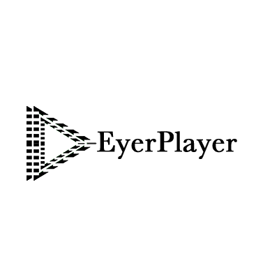

# EyerPlayer for QT

- EyerPlayer 是基于 Qt 和 FFmpeg 开发的一款视频播放器。




> logo设计与制作(著作权归属) : porschegt23@foxmail.com (Q:531365872)

## Build

### Mac

- 先对 FFmpeg 进行编译（也可自行编译）

```
sh init_3rdlib.sh
```
- 直接使用 QtCreator 打开 EyerPlayerLib 工程，默认编译的输出是一个 Demo 的可执行程序，编译库可以看 pro 文件中的说明。

### Windows

- 先对 FFmpeg 进行编译（也可自行编译）使用 msys 环境

```
sh init_3rdlib_msys.sh
```
- 直接使用 QtCreator 打开 EyerPlayerLib 工程，默认编译的输出是一个 Demo 的可执行程序，编译库可以看 pro 文件中的说明。

### Linux

Doing...
